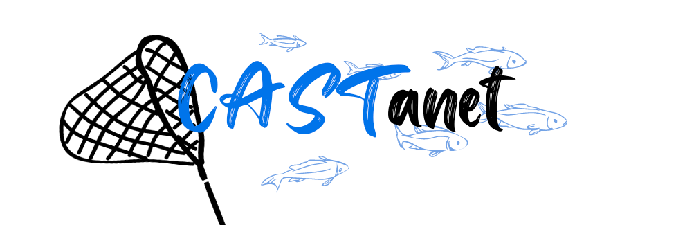

# CASTanet



## Table of Contents

* [About CASTanet](#about-castanet)

* [Installing CASTanet](#installing-castanet)

* [Running CASTanet](#running-castanet)

* [CASTanet's Command Line Interface](#castanets-command-line-interface)

* [Testing](#testing)

* [Contributions](#contributions)

* [Contact Us](#contact-us)

## About CASTanet

## Installing CASTanet

**1. Clone the CASTanet repository onto your machine**

In the appropriate directory, clone the repository with the `git clone` command and a following web URL or SSH key.

With HTTPS:

```
git clone https://github.com/cmpsc-481-s22-m1/CASTanet.git
```

With SSH Key:

```
git clone git@github.com:cmpsc-481-s22-m1/CASTanet.git
```

**2. Install Poetry and dependencies**

The documentation and instructions on installing _Poetry_ can be found [here.](https://python-poetry.org/docs/)

_Poetry_ allows dependency installation with ease. After cloning the CASTanet repository, and installing _Poetry_, install all necessary dependencies for the tool with the command:

`poetry install`

## Running CASTanet

CASTanet is a fully-functional tool with a dynamic command line interface, built with the user in mind. To run the CASTanet CLI, move into the `castanet` directory of your local, cloned repository and type the command:

```
poetry run python main.py [command-here]
```

Without specifying a command, you will receive this error in your terminal:

```
Usage: main.py [OPTIONS] COMMAND [ARGS]...
Try 'main.py --help' for help.

Error: Missing command.
```

Please refer to the next section to see what functionality CASTanet has, and what commands to run.

### CASTanet's Command Line Interface - Commands

CASTanet's command line interface is created with [Typer](https://typer.tiangolo.com/), a library for building CLI applications based on Python 3.6+ type hints.

**CASTanet's commands are as follows:**

* `generate-trees`: This command _must_ be run before running any other commands to generate the concrete-abstract-syntax-trees required for the rest of the programs
  * **Parameter**: File path of the directory of interest (directory must be locally installed on your machine)

```
poetry run python main.py generate-trees path/of/directory
```

* `if-statements`: Determine the total number of if statements in the Python files of a given directory

```
poetry run python main.py if-statements
```

* `looping-constructs`: Determine the total number of looping constructs (for loops, and while loops) in the Python files of a given directory

```
poetry run python main.py looping-constructs
```

* `comments`: Determine the total number of comments in the Python files of a given directory

```
poetry run python main.py comments
```

* `functions-without-docstrings`: Determine the total number of functions _without_ dosctrings in the Python files of a given directory

```
poetry run python main.py functions-without-docstrings
```

Currently, CASTanet only has functionality for _one_ metric to be calculated at a time. As a result, if you are interested in one or more metric, you must run CASTanet for the first metric (with the corresponding CLI command), and then run CASTanet subsequently for each additional metric (with the corresponding CLI command).

## Testing

### Automated Testing

Developers of this program can run the test suite with [Pytest](https://docs.pytest.org/en/stable/) with the command:

`poetry run pytest`

## Contributions

We welcome everyone who is interested in helping to improve CASTanet! If you are interested in being a contributor, please review our [Code of Conduct](https://github.com/cmpsc-481-s22-m1/CASTanet/blob/documentation/CODE_OF_CONDUCT.md) and [Guidelines for Contributors](https://github.com/cmpsc-481-s22-m1/CASTanet/blob/documentation/CONTRIBUTING.md) before raising an issue, or beginning a contribution.

To raise an issue in [CASTanet's Issue Tracker](https://github.com/cmpsc-481-s22-m1/CASTanet/issues) please follow these templates:

* [bug_report.md](https://github.com/cmpsc-481-s22-m1/CASTanet/blob/documentation/.github/ISSUE_TEMPLATE/bug_report.md)

* [feature_request.md](https://github.com/cmpsc-481-s22-m1/CASTanet/blob/documentation/.github/ISSUE_TEMPLATE/feature_request.md)

To create a pull request, please follow this template:

* [pull_request_template.md](https://github.com/cmpsc-481-s22-m1/CASTanet/blob/documentation/.github/pull_request_template.md)

## Contact Us

If you have any questions or concerns about CASTanet, please contact:

* Madelyn Kapfhammer (kapfhammerm@allegheny.edy)
* Thomas Antle (antlet@allegheny.edu)
* Nolan Thompson (thompsonn2@allegheny.edu)
* Caden Hinckley (hinckleyc@allegheny.edu)
* Bailey Matrascia (matrasciab@allegheny.edu)
